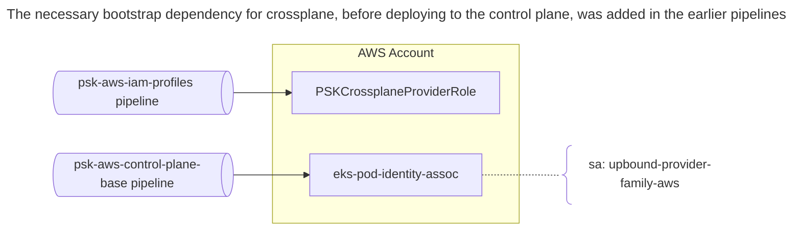
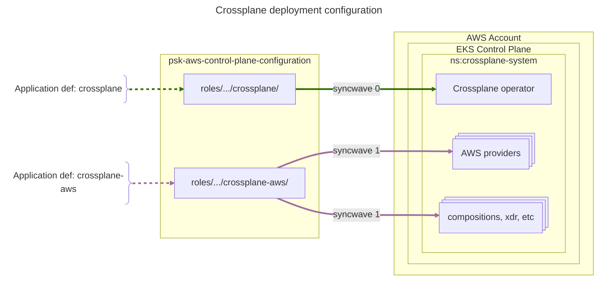

# psk-platform-ext-crossplane

This pipeline deploys two Argo Applications. In SyncWave 0, Crossplane itself is deployed, without any providers or other specific configurations. In SyncWave 1, the psk-crossplane-resource Helm chart is used to make those customizations.  

Obviously, as this is an AWS implementation, we need to in tall AWS providers. Crossplane will provide the general on-cluster ability tfor developers to provision specific paltform-supported AWS resources,and we'd like to use it where appropriate to assist in managing other platform services or extensions. For example, we will use cert-manager and external-dns as part of the istio implementation. Those extensions need eks-pod-identities that grant permissions to interact with Route53. But of course, before Crossplane can provision things it needs permission to do so. We need to first have a Role that the Crossplane provider can use to interact with the AWS api.  

As a general role used in all the clusters, the `PSKCrossplaneProviderRole` was created in each account in the psk-aws-iam-profiles pipeline. This role was then used to define an `"aws_eks_pod_identity_association" "crossplane_provider"`, created during the EKS provisioning in the psk-aws-platform-control-plane-base pipeline.  

Deployment structure diagrams.

Once the family provider has access, we can now use crossplane capabilities directly to create additionl eks-pod-identity associations as needed.  

Initial these providers are required for cert-manager, external-dns, and other similar extensions that require an eks-podidentity in order to function.  
* provider-family-aws
* provider-aws-iam
* provider-aws-eks

Additional packages currently in the psk lab control plane are:
* 

Currently installed Functions are:
* function-patch-and-transform
* function-go-templating
* function-extra-resources

## maintainers

to add a provider or function, modify the values.yaml in the local psk-crossplane-resources helm chart.  
```yaml

providers:
  packages:
    - xpkg.upbound.io/upbound/provider-family-aws:v2.5.3
    - xpkg.upbound.io/upbound/provider-aws-iam:v2.5.3
    - xpkg.upbound.io/upbound/provider-aws-eks:v2.5.3

function:
  packages:
    - xpkg.upbound.io/crossplane-contrib/function-patch-and-transform:v0.10.4
    - xpkg.upbound.io/crossplane-contrib/function-go-templating:v0.12.0
    - xpkg.crossplane.io/crossplane-contrib/function-extra-resources:v0.3.0
```


# adding AWS provider packakges

Modify the `deploy-templates/default-values.yaml` to include additional packages, functions, etc  
```yaml
...
provider:
  # -- A list of Provider packages to install.
  packages:
    - xpkg.upbound.io/upbound/provider-family-aws:v2.5.3
    - xpkg.upbound.io/upbound/provider-aws-iam:v2.5.3
    - xpkg.upbound.io/upbound/provider-aws-eks:v2.5.3

configuration:
  # -- A list of Configuration packages to install.
  packages: []

function:
  # -- A list of Function packages to install
  packages:
    - xpkg.upbound.io/crossplane-contrib/function-patch-and-transform:v0.10.4
    - xpkg.upbound.io/crossplane-contrib/function-go-templating:v0.12.0
...
```

Then, add a DeploymentRuntimeConfig and ImageConfig for the package to `deploy-templates/resources/serviceaccounts.yaml`. This sets the provider package serviceaccount name to be predictable rather than with a serialized postfix number attached. Below is an example for the upbound-provider-aws-eks.  
```yaml
# upbound-provider-aws-eks
---
apiVersion: pkg.crossplane.io/v1beta1
kind: DeploymentRuntimeConfig
metadata:
  name: runtime-upbound-provider-aws-eks
spec:
  serviceAccountTemplate:
    metadata:
      name: upbound-provider-aws-eks

---
apiVersion: pkg.crossplane.io/v1beta1
kind: ImageConfig
metadata:
  name: runtime-upbound-provider-aws-eks
spec:
  matchImages:
    - prefix: xpkg.upbound.io/upbound/provider-aws-eks
  runtime:
    configRef:
      name: runtime-upbound-provider-aws-eks
```

And finally, add a CrossplanePodIdentityAssociation to `deploy-templates/resources/pod-identity-associations.yaml` for the serviceaccount so that it will be assigned the PSKCrossplaneProvderRole to enable it to provision AWS resources. Below is the upbound-provider-aws-eks example:  
```yaml
---
apiVersion: platform.io/v1alpha1
kind: CrossplanePodIdentityAssociation
metadata:
  name: crossplane-provider-eks
spec:
  serviceAccount: upbound-provider-aws-eks
  namespace: crossplane-system
```

# adding Functions

Similar pattern

```yaml
---
apiVersion: pkg.crossplane.io/v1beta1
kind: DeploymentRuntimeConfig
metadata:
  name: runtime-crossplane-contrib-function-go-templating
spec:
  serviceAccountTemplate:
    metadata:
      name: crossplane-contrib-function-go-templating
---
apiVersion: pkg.crossplane.io/v1beta1
kind: Function
metadata:
  name: runtime-crossplane-contrib-function-go-templating
spec:
  package: xpkg.crossplane.io/crossplane-contrib/function-go-templating
  runtimeConfigRef:
    name: runtime-crossplane-contrib-function-go-templating
```