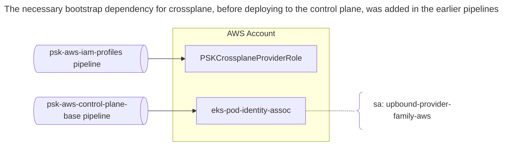
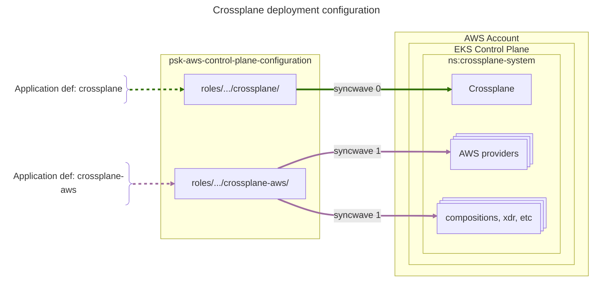

<div align="center">
	<p>
	
	<h2>psk-platform-ext-crossplane</h2>
	<a href="https://opensource.org/licenses/MIT"></a> <a href="https://aws.amazon.com"></a>
	</p>
</div>

This pipeline deploys two Argo Applications. In SyncWave 0, Crossplane itself is deployed, without any providers or other specific configurations. In SyncWave 1, the psk-crossplane-resource Helm chart is used to make those customizations.  

Obviously, as this is an AWS implementation, we need to in tall AWS providers. Crossplane will provide the general on-cluster ability tfor developers to provision specific paltform-supported AWS resources,and we'd like to use it where appropriate to assist in managing other platform services or extensions. For example, we will use cert-manager and external-dns as part of the istio implementation. Those extensions need eks-pod-identities that grant permissions to interact with Route53. But of course, before Crossplane can provision things it needs permission to do so. We need to first have a Role that the Crossplane provider can use to interact with the AWS api.  

As a general role used in all the clusters, the `PSKCrossplaneProviderRole` was created in each account in the psk-aws-iam-profiles pipeline. This role was then used to define an `"aws_eks_pod_identity_association" "crossplane_provider"`, created during the EKS provisioning in the psk-aws-platform-control-plane-base pipeline.  

Deployment structure diagrams.

```mermaid
---
title: The necessary bootstrap dependency for crossplane, before deploying to the control plane, was added in the earlier pipelines
---
flowchart LR

    IAMPROFILES@{ shape: das, label: "psk-aws-iam-profiles pipeline" }
    BASE@{ shape: das, label: "psk-aws-control-plane-base pipeline" }

    subgraph AWS Account
        ROLE[PSKCrossplaneProviderRole]
        ASSOC[eks-pod-identity-assoc]
    end

    SA@{ shape: brace-l, label: "sa: upbound-provider-family-aws" }

    IAMPROFILES --> ROLE
    BASE --> ASSOC
    ASSOC -.- SA
```
Once the family provider has access, we can now use crossplane capabilities directly to create additionl eks-pod-identity associations as needed.  

```mermaid
---
title: Crossplane deployment configuration
---
flowchart LR

    subgraph AWS Account
        subgraph EKS Control Plane
            subgraph ns:crossplane-system
                CP[Crossplane]
                PRO@{ shape: procs, label: "AWS providers"}
                COMP@{ shape: procs, label: "compositions, xdr, etc"}
            end
        end
    end
    subgraph psk-aws-control-plane-configuration
        AOA["roles/.../crossplane/"]
        AOAAWS["roles/.../crossplane-aws/"]
    end

    APPCP@{ shape: brace-r, label: "Application def: crossplane" }
    APPAWS@{ shape: brace-r, label: "Application def: crossplane-aws" }

    APPCP --> AOA --> |syncwave 0| CP
    APPAWS --> AOAAWS -- syncwave 1 --> PRO & COMP

    linkStyle 0 stroke:#306F00,stroke-width:3px,stroke-dasharray:5 5
    linkStyle 1 stroke:#306F00,stroke-width:3px

    linkStyle 2 stroke:#A06DA0,stroke-width:3px,stroke-dasharray:5 5
    linkStyle 3 stroke:#A06DA0,stroke-width:3px
    linkStyle 4 stroke:#A06DA0,stroke-width:3px
```

The initial providers installed provide support for eks changes, including creating eks-pod-identities when needed to other extensions:  
* provider-family-aws
* provider-aws-iam
* provider-aws-eks

Initial installed Functions:
* function-patch-and-transform
* function-go-templating
* function-extra-resources
* function-auto-ready

As initially installed, crossplane is restricted from use to only cluster-administrators. This enables cluster configuration management to make use of crossplane features to provide capabilities for the control plane and for future developer "Users." THe future platform-provided infrastructure will make use of Crossplane Compositions to provider Developer access to infrastructure. In this way, crossplane can provision and maintain infrastructure on the developers behalf, subject to any policies or guardrails, and without needing to provider direct Developer access to crossplane operator capabilities.  

## Developer facing capabilities

_pending_  

## maintainers
### providers
to add a provider or function, modify the aws-default-values.yaml in the local `deploy-templates` folder.  
```yaml

providers:
  packages:
    - xpkg.upbound.io/upbound/provider-family-aws:v2.5.3
    - xpkg.upbound.io/upbound/provider-aws-iam:v2.5.3
    - xpkg.upbound.io/upbound/provider-aws-eks:v2.5.3

function:
  packages:
    - xpkg.upbound.io/crossplane-contrib/function-patch-and-transform:v0.10.4
    - xpkg.upbound.io/crossplane-contrib/function-go-templating:v0.12.0
    - xpkg.crossplane.io/crossplane-contrib/function-extra-resources:v0.3.0
```
All of these packages have a DeploymentRuntimeConfig that modifies the service account to be predictable so that an eks-pod-identity-association can be created for each provider or function added, along with toleration, node-selectors, and other deployment configuration changes. Note, a deploymemt can only have a single such runtime config associated with it.

### functional testing

The post-deployment functional testing obviously needs to run against specific clusters. With the actual small scale of the psk lab clusters we just demonstrate the testing directly. In a higher scale setting, this is where a global list of clusers and roles would assist in triggering a dedicated test pipeline that could perform parallel testing across role clusters.

### release versioning  

[chart vervsion][feature version]  
[x.x.x][.xxxx]  

In general the individual services or extensions managed through the distributed cluster configuration management via ARgoCD Core, will have release versions that map 1-to-1 with the chart version being deployed. For extensions that can additional customization as part of providing capabiltiies to the user (e.g., Istio, Crossplane, and so on), each sucessive update will use a trailing 4-digit semantic addition to indicate the release versions changes to those additional configurations.  

In the case of Crossplane, the helm chart version could be 2.3.1 and this may the 18th release of the compositions and XRDs made available to platform Users - in which case the release version for this pipeline to production would be 2.3.1.0018  

2.3.5


aws provider versions
2.5.5
2.6.0
2.7.0
2.7.1


kubernetes-provider 1.3.1

  packages:
    - xpkg.upbound.io/crossplane-contrib/function-patch-and-transform:v0.10.4   - 0.10.9
    - xpkg.upbound.io/crossplane-contrib/function-go-templating:v0.12.0         - 0.12.3
    - xpkg.crossplane.io/crossplane-contrib/function-extra-resources:v0.3.0
    - xpkg.crossplane.io/crossplane-contrib/function-auto-ready:v0.6.5          - 0.6.7
